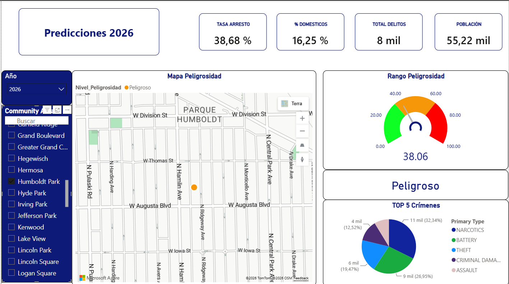

# Chicago Crime Analysis

Análisis de la criminalidad en Chicago (2020-2024) y modelo predictivo para 2025-2027,
desarrollado como proyecto final del Bootcamp de Data Analytics de Neoland.


## Resumen

A partir de más de 1,4 millones de registros de criminalidad del [Chicago Data Portal](https://data.cityofchicago.org/),
este proyecto combina un análisis exploratorio completo, variables socioeconómicas (desempleo,
pobreza, renta per cápita, educación) y un modelo de Machine Learning (Random Forest) para
predecir el número de crímenes por zona (*Community Area*) en 2025-2027.

El resultado final se comunica a través de una [presentación ejecutiva](presentacion/Chicago_Crime_Presentacion.pdf)
y un [dashboard interactivo en Power BI](#dashboard) con mapa de peligrosidad por zona.

## Equipo

Proyecto desarrollado en equipo de 4 personas como proyecto final del Bootcamp de Data
Analytics de Neoland.

**Mi contribución:**
- Limpieza de datos y EDA completo (`notebooks/01_eda.ipynb`)
- Integración y consultas con SQL Server (Window Functions, agregaciones)
- Mapa de calor geográfico y análisis temporal (estacionalidad, franjas horarias)
- Exploración de enfoques alternativos para el modelo predictivo (`notebooks/02_exploracion_modelos.ipynb`)
- Desarrollo conjunto del modelo final (Random Forest)
- Diseño del dashboard final en Power BI

El modelo predictivo final (`notebooks/03_modelo_final.ipynb`) fue desarrollado de forma
conjunta con otro miembro del equipo.

## Estructura del repositorio

```
chicago-crime-analysis/

- data/                              Datasets (no incluidos por tamaño, ver más abajo)
- notebooks/
  - 01_eda.ipynb                     Limpieza, EDA, SQL, mapas, estacionalidad
  - 02_exploracion_modelos.ipynb     Proceso de iteración: PCA, índice propio, pivote de enfoque
  - 03_modelo_final.ipynb            Random Forest, comparación de modelos, predicción 2025-2027
- outputs/                           CSVs de resultados (ver nota más abajo)
- presentacion/
  - Chicago_Crime_Presentacion.pdf   Presentación ejecutiva del proyecto
- dashboard/
  - dashboard_preview.png            Captura del dashboard de Power BI
- README.md
```

## Datos

El dataset principal de crímenes (~1,45M de registros, 2020-2024) procede del
[Chicago Data Portal — Crimes 2001 to present](https://data.cityofchicago.org/Public-Safety/Crimes-2001-to-Present/ijzp-q8t2)
y no se incluye en el repositorio por su tamaño. Para reproducir el análisis:

1. Descarga el dataset filtrado a 2020-2024 desde el enlace anterior (o usa la consulta SQL
   incluida en `notebooks/02_exploracion_modelos.ipynb` para descargarlo vía API).
2. Guárdalo como `data/chicago_crimes_2020_2024.csv`.

Las variables socioeconómicas por *Community Area* (`data/Variables_socioeconomicas.xlsx` y
`data/Chicago_Health_Atlas_Community_Areas.csv`) **sí están incluidas** en el repositorio, ya
que son archivos pequeños. Fuente original: [Chicago Health Atlas](https://chicagohealthatlas.org/).

> **Nota sobre `outputs/`:** la carpeta incluye los CSVs de resultados generados por los
> notebooks (predicciones 2025-2027, tipos de crimen por zona, resumen por *Community Area*).
> El mapa de calor interactivo (`mapa_crimenes.html`) no se incluye por tamaño; se regenera
> automáticamente al ejecutar `01_eda.ipynb`.

> **Nota sobre el enfoque geográfico:** el EDA inicial (`01_eda.ipynb`) se realizó a nivel de
> *distrito policial* (District), la unidad con la que trabaja el departamento de policía de
> Chicago. Al incorporar variables socioeconómicas para el modelo predictivo, el equipo migró
> el análisis a nivel de ***Community Area***, que es la unidad geográfica estándar utilizada
> por las fuentes de datos socioeconómicos (US Census, Chicago Health Atlas). Este cambio
> permitió cruzar ambos tipos de datos de forma consistente.

## Metodología

### 1. EDA (`01_eda.ipynb`)

- Limpieza de nulos y duplicados sobre 1,45M de registros.
- Conversión y extracción de variables temporales (año, mes, hora).
- Consultas SQL (Window Functions: `ROW_NUMBER() OVER PARTITION BY`) para extraer los tipos de
  crimen más frecuentes por año y por distrito.
- Mapa de calor geográfico (Folium) y heatmaps de criminalidad por distrito y año (Seaborn).
- Normalización de crímenes por población (tasa por 100.000 habitantes).

**Principales hallazgos:**
- Tendencia bajista en el número total de crímenes entre 2020 y 2024.
- `THEFT` y `BATTERY` son los dos tipos de crimen más frecuentes en todos los años.
- Estacionalidad clara: los meses de verano concentran más crímenes, con un patrón nocturno
  más marcado en julio y agosto.
- Distribución geográfica no homogénea, con distritos muy por encima de la media incluso
  normalizando por población.

### 2. Exploración de modelos (`02_exploracion_modelos.ipynb`)

Antes de llegar al modelo final, se exploraron varios enfoques:

| Enfoque probado | Resultado | Limitación principal |
|---|---|---|
| PCA + Regresión Lineal (nivel registro) | R² ≈ 0.30 | Variables de zona aplicadas a 1,4M de registros individuales |
| PCA + Regresión Lineal (nivel zona agregada) | R² ≈ 0.51 | Solo 77 observaciones (una por zona) |
| Tendencia lineal por zona y año | No robusto | Solo 5 años de histórico por zona |
| Ampliación a 10 años (2015-2024) vía API | R² ≈ 0 | Variables socioeconómicas sin resolución anual |

**Aprendizaje clave:** el cuello de botella no era el algoritmo, sino la **granularidad de
las variables socioeconómicas**. Este diagnóstico definió el enfoque del modelo final.

### 3. Modelo final (`03_modelo_final.ipynb`)

Modelo **Random Forest Regressor** (300 árboles) entrenado con variables anualizadas:
año, población, tasa de desempleo, tasa de pobreza, renta per cápita y nivel educativo.

| Modelo | MAE | RMSE | R² |
|---|---|---|---|
| **Random Forest** | **331.3** | **541.5** | **0.977** |
| Regresión Lineal | 1,390.7 | 1,880.6 | 0.633 |
| Dummy (media) | 2,636.7 | 3,601.1 | -0.0004 |

El modelo se utilizó para proyectar el número de crímenes por zona en 2025, 2026 y 2027,
estimando previamente la evolución de las variables socioeconómicas a partir de su tasa de
crecimiento anual 2020-2024.

## Dashboard

El dashboard interactivo en Power BI permite filtrar por año y *Community Area*, mostrando:
- Mapa de peligrosidad por zona (con clasificación: seguro / peligroso / muy peligroso)
- Indicadores clave: tasa de arresto, % de crímenes domésticos, total de delitos, población
- Top 5 tipos de crimen por zona
- Índice de peligrosidad (gauge 0-100)



Casos destacados analizados en la [presentación](presentacion/Chicago_Crime_Presentacion.pdf):
- **Fuller Park** — la zona con mayor índice de peligrosidad predicho (94.06/100).
- **Forest Glen** — la zona más segura, con un índice de 1.69/100.

## Stack técnico

- **Python**: Pandas, NumPy, Matplotlib, Seaborn, Folium, scikit-learn, statsmodels
- **SQL Server**: consultas con CTEs y Window Functions
- **Power BI**: dashboard interactivo con mapas y filtros dinámicos
- **Fuentes de datos**: Chicago Data Portal, Chicago Health Atlas

## Cómo ejecutar este proyecto

```bash
# 1. Clona el repositorio
git clone https://github.com/VR-Alejandro/chicago-crime-analysis.git
cd chicago-crime-analysis

# 2. Instala las dependencias
pip install pandas numpy matplotlib seaborn folium scikit-learn statsmodels openpyxl

# 3. Descarga los datasets (ver sección "Datos" más arriba) en la carpeta data/

# 4. Ejecuta los notebooks en orden
jupyter notebook notebooks/01_eda.ipynb
```

## Contacto

**Alejandro Villodres Romero**
[LinkedIn](https://www.linkedin.com/in/alejandro-villodres-romero) ·
[GitHub](https://github.com/VR-Alejandro) ·
alejandrovillodres.job@gmail.com
